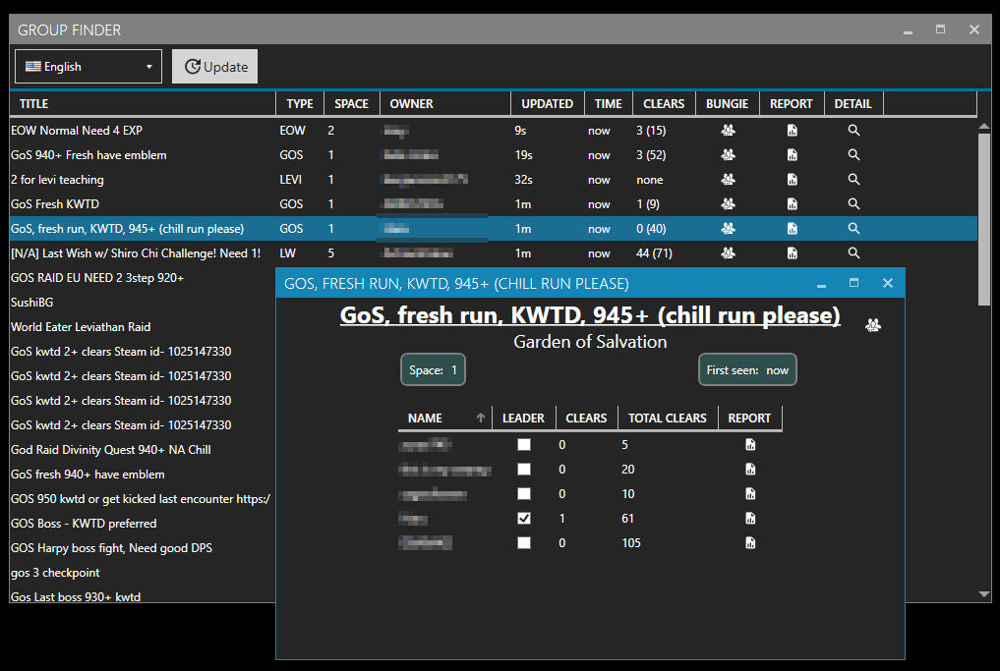

# Destiny2GroupFinder

The "Group Finder" collects data about Destiny 2 raid groups from the [bungie](https://www.bungie.net) website and combines the information with the data from [raid.report](https://raid.report) in order to display a nice overview over open raid groups.

The displayed information consists of:

- Title:  
  The title of the group on the bungie site
- Type:  
  The raid which is searched for (I try to get this form the titel but typos or bossnames are not checked for)
- Space:  
  The number of open slots in this group 
- Owner:  
  The person who opened the group (bungie name)
- Updated:  
  The "updated" time according to bungie (is changed everytime someone joins/leaves the group)
- Time:  
  The time the program first saw this group
- Clears:  
  The number of clears the person has for this raid (including checkpoints) and the number of fullclears on all raids (in brackets)
- Bungie:  
  Link to the bungie group
- Report:  
  Link to the raid report of the owner of the group

Currently the program queries the bungie site every minute for updated information, by pressing the update button this can be triggered manually.  
Languages are currently limited to english and german.       
